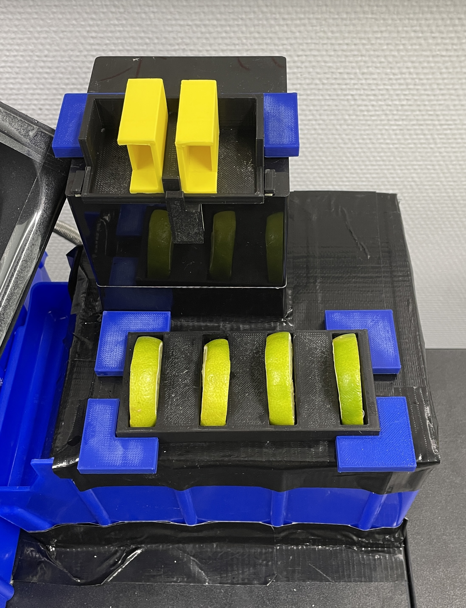
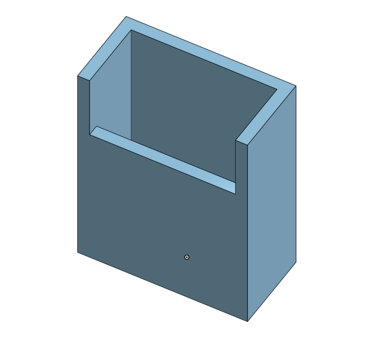

# Fruit Slice on the edge of a glass

## Table of Contents

1. [Introduction](#introduction)
2. [Preparation](#preparation)
   - [Process Preparations](#prozess-preparations)
   - [CPEE](#cpee)
3. [Process](#process)
   - [Demo Process](#demo-process)
     - [Graph](#graph)
     - [Endpoints](#endpoints)
     - [Data Elements](#data-elements)
   - [Individual Process](#individual-process)
     - [Graph](#graph-1)
     - [Endpoints](#endpoints-1)
     - [Data Elements](#data-elements-1)
4. [3D Models](#3d-models)
   - [Finger_Depot_V1](#finger_depot_v1)
   - [FingerProtectionV2](#fingerprotectionv2)
   - [Lime Slice Holder_V2](#lime-slice-holder_v2)
   - [Front_Mount_Depot_V1](#front_mount_depot_v1)
   - [Side_Mount_Depot_V1](#side_mount_depot_v1)
   - [Edges](#edges)
5. [Further Hints](#further-hints)

## Introduction

Every beautiful cocktail needs decoration. The robot therefore places a slice of lime on the edge of a glass.

## Preparation

### Prozess Preparations

- Turn the cobot into automatic and remote
- Ensure that a glas is in the "Cocktail-In-progress" position
- Put four lime slices in the lime slice holder with a little slot in each slice above the marker in the middle. Each lime slice should have a thickness of 0.9 cm to 1.3 cm.
- The finger protection shall be placed in the protection depot on the middle bar so that the longer side of the protection faces inwards.
  

### CPEE

- Go to https://cpee.org/hub/?stage=development&dir=Teaching.dir/Prak.dir/TUM-Prak-24-SS.dir/
- Open "fruit_slice.xml" or "fruit_slice_demo.xml" depending if you want to see a demo loop or the individual process
- Start the process by clicking start in the execution tab

## Process

### Demo Process

This process is for demonstration purposes and shows a sample integration of the individual process. In this demo-scenario the process is executed four times in a row. This process can be seen in the [Demo Process-Video](//Demo%20Process.mp4). In the background, the limes are removed from the glass rim and placed back in the lime holder.

#### Graph

- a1-Home Start: Moves from Home Position to the "Cocktail-In-Progress" glas. [Video: Step_1](Video_Process_Steps/Step_1.mp4)
- Loop: Verifies that the index is smaller than the max number of fruits in the holder.
- a2-Place Slice: executes the subprocess of the "fruit_slice.xml". The fruit_index is passed to the subprocess. [See Videos: Step 2-6](Video_Process_Steps)

  

- a3-Next Fruit Slice Index Increase: Increases the fruit_index variable by 1
- a4-Return Home: Returns to the Home Position from the "Cocktail-In-Progress"" glas. [Video: Step_7](Video_Process_Steps/Step_7.mp4)

#### Endpoints

#### Data Elements

- fruit_index: initial 0 (is increased in each loop executioon)
- no_of_fruits: maximal number of fruits in the holder -> 4

### Individual Process

This is the process which would be integrated into the cocktail process as a subprocess like in the Demo-Process.

#### Graph

- a1-Pickup Finger Protection: Moves to the Finger Protection and picks up the protection by sliding into. [Video: Step_2](Video_Process_Steps/Step_2.mp4)
- a2-Set Index Register Value: This sets the index of the fruit slice by setting it in the register of the cobot.
- a3-Pickup Fruit Slice: Picks up the FruitSlice depending on the registert value. This is done by an offset. For this purpose Index 0 is safed as a Fruit0 in the default installation. [Video: Step_3](Video_Process_Steps/Step_3.mp4)
- a4-Place Slice: The cobot places the slice on the edge of the "Cocktail-In-Progress"-glas. [Video: Step_4](Video_Process_Steps/Step_4.mp4)
- a5-Place Protection: The cobot places the protection in the Protection Depot and pushes the protection in the starting position. [Video: Step_5](Video_Process_Steps/Step_5.mp4)
- a6-Returns to working position: The cobot returns to the "Cocktail-In-Progress"-glas. [Video: Step_6](Video_Process_Steps/Step_6.mp4)

#### Endpoints

#### Data Elements

- Has no created data elements, because fruit_index is passed to this subprocess.

## 3D Models

The 3D Models are stored in .stl format in the folder "3D Models". A brief description of each model is given below.

### Finger_Depot_V1

This is the place where the finger protection will be placed.

### FingerProtectionV2

This ensures that the cobot doesn't get sticky fingers. The longer side is where the robot touches the lime slice. The other side is shorter because of a bulge on the robot's finger.

### Lime Slice Holder_V2

This is where the lime slices are placed.

### Front_Mount_Depot_V1

This is a small mount on the front of the depot to keep it in position.

### Side_Mount_Depot_V1

This is a small mount of the side of the depot to keep it in position

### Edges

The corners have already been present in the lab.

## Further Hints

- In the default installation of the cobot there is the Point Fruit0 which is the Waypoint for the index 0.
- The finger depot and the lime slice holder can be removed from the position brackets for cleaning.
- To integrate the process into the cocktail process, include the "fruit_slice" process as a subprocess like in the demo process.
